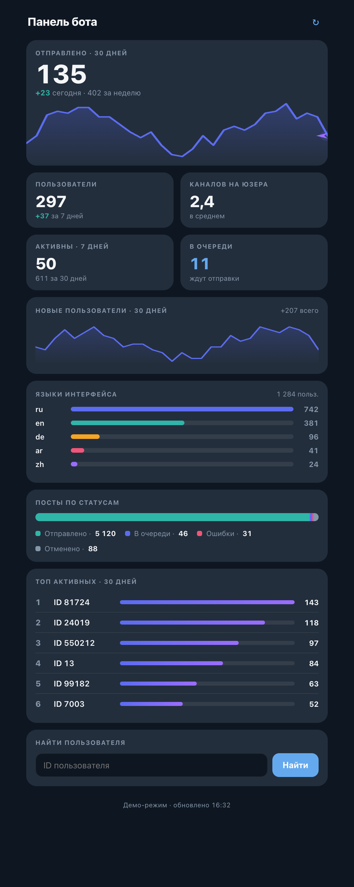

# Auto Sender Bot

Telegram-бот для планирования и автоматической публикации сообщений в каналах и группах.

## Возможности

- 📅 **Планирование публикаций** — создавайте текстовые посты и медиа-альбомы с указанием точного времени публикации
- ⏰ **Автоматическая отправка** — бот автоматически публикует запланированные посты в указанное время
- 🌍 **Поддержка часовых поясов** — настройте свой часовой пояс для удобного планирования в локальном времени
- 📱 **Управление каналами** — привязывайте несколько каналов и групп к одному аккаунту
- 📋 **Очередь публикаций** — просматривайте и отменяйте запланированные посты
- 🌐 **Многоязычный интерфейс** — поддержка английского, русского, немецкого, арабского, хинди, китайского и японского языков
- 🖼️ **Медиа-альбомы** — поддержка публикации до 10 фото/видео в одном посте
- 📝 **Форматирование текста** — сохранение Markdown-разметки и форматирования сообщений
- 👀 **Предпросмотр «на месте»** — при выборе поста в очереди старый предпросмотр заменяется новым, а не копится стопкой
- 📊 **Админ-панель (Telegram Mini App)** — веб-дашборд со статистикой бота, открывается командой `/admin`

## Требования

- Python 3.10+
- Telegram Bot Token (получить у [@BotFather](https://t.me/BotFather))
- Права администратора в каналах/группах, куда планируется публикация

## Установка

1. Клонируйте репозиторий:
```bash
git clone https://github.com/parssifal/auto-sender-bot.git
cd auto-sender-bot
```

2. Создайте виртуальное окружение и установите зависимости:
```bash
python3 -m venv .venv
source .venv/bin/activate  # На Windows: .venv\Scripts\activate
pip install -r requirements.txt
```

3. Скопируйте файл с примерами конфигурации и настройте его:
```bash
cp .env.example .env
```

4. Отредактируйте `.env` и укажите токен бота:
```env
BOT_TOKEN="your_bot_token_here"
```

## Настройка

Основные параметры конфигурации в файле `.env`:

- `BOT_TOKEN` (обязательно) — токен бота от BotFather
- `DB_PATH` (опционально) — путь к файлу базы данных SQLite (по умолчанию: `data/bot.db`)
- `LOG_LEVEL` (опционально) — уровень логирования: `DEBUG`, `INFO`, `WARNING`, `ERROR` (по умолчанию: `INFO`)
- `SCHEDULER_POLL_SECONDS` (опционально) — интервал проверки запланированных постов в секундах (по умолчанию: `2.0`)
- `TELEGRAM_POLLING_TIMEOUT_SECONDS` (опционально) — таймаут long-polling для Telegram API (по умолчанию: `30`)
- `TELEGRAM_HTTP_TIMEOUT_SECONDS` (опционально) — таймаут HTTP-запросов к Telegram API (по умолчанию: `75`)
- `ADMIN_IDS` (опционально) — Telegram-ID администраторов через запятую, кому доступна команда `/admin` (алиас: `BOT_ADMIN_IDS`)
- `WEBAPP_URL` (опционально) — публичный HTTPS-адрес мини-приложения; без него `/admin` выключен
- `WEBAPP_HOST` / `WEBAPP_PORT` (опционально) — адрес и порт HTTP-сервера мини-аппа (по умолчанию: `0.0.0.0:8081`)

## Запуск

```bash
python main.py
```

## Использование

### Первоначальная настройка

1. Добавьте бота администратором в канал или группу с правами на публикацию сообщений
2. Установите часовой пояс командой `/timezone` или через меню "Timezone"
3. Выберите язык интерфейса через меню "Language" или командой `/language`

### Планирование публикации

1. Откройте меню "Schedule" или используйте команду `/schedule`
2. Выберите канал/группу для публикации
3. Введите дату и время в формате `DD.MM.YYYY HH:MM` (например, `22.02.2026 15:30`)
4. Выберите тип публикации:
   - **Text** — текстовое сообщение
   - **Media** — медиа-альбом (фото/видео) с опциональной подписью
5. Отправьте контент (текст или медиа)
6. Подтвердите публикацию

### Управление очередью

- Используйте меню "Queue" или команду `/queue` для просмотра запланированных публикаций
- Отмените публикацию, нажав на соответствующую кнопку

### Управление каналами

- Просмотр списка каналов: меню "My channels/chats" или команда `/destinations`
- Добавление канала по username: `/link @channel_username`
- Добавление приватного канала: `/link_forward` и пересылка сообщения из канала

## Админ-панель (Telegram Mini App)

Команда `/admin` открывает веб-дашборд со статистикой бота прямо внутри Telegram: пользователи и рост, среднее число каналов, активность, посты по статусам, языки интерфейса и топ активных пользователей.

<p align="center">
  
</p>

**Как включить:**

1. Укажите свои Telegram-ID в `.env`:
   ```env
   ADMIN_IDS="123456789"
   ```
2. Задайте публичный HTTPS-адрес мини-аппа. Telegram открывает Mini App только по HTTPS с валидным сертификатом. Сервер отдаёт обычный HTTP на `WEBAPP_PORT`, а TLS терминируется снаружи:
   - **Прод:** домен + reverse proxy (например, [Caddy](https://caddyserver.com/) с автоматическим Let's Encrypt), проксирующий на `WEBAPP_PORT`.
   - **Тест:** `cloudflared tunnel --url http://localhost:8081` выдаёт временный HTTPS-адрес.
   ```env
   WEBAPP_URL="https://your-domain.example"
   ```
3. Перезапустите бота и отправьте ему `/admin`.

Доступ есть только у пользователей из `ADMIN_IDS`; авторизация выполняется через подписанный `initData` Telegram — паролей не требуется.

## Команды

- `/start` — начать работу с ботом
- `/schedule` — создать запланированную публикацию
- `/queue` — просмотреть очередь публикаций
- `/destinations` — управление каналами
- `/timezone` — настройка часового пояса
- `/language` — выбор языка интерфейса
- `/link @username` — привязать канал по username
- `/link_forward` — привязать приватный канал через пересылку
- `/admin` — открыть админ-панель (только для `ADMIN_IDS`)
- `/cancel` — отменить текущую операцию

## Архитектура

Проект состоит из следующих модулей:

- `main.py` — точка входа, инициализация бота и планировщика
- `core/` — основная логика:
  - `state.py` — управление состоянием и базой данных
  - `scheduler.py` — планировщик публикаций
  - `notifier.py` — отправка сообщений в Telegram
  - `config.py` — загрузка конфигурации
  - `timezone_resolver.py` — определение часового пояса по координатам
  - `webapp.py` — HTTP-сервер админ-панели (aiohttp): статистика и авторизация по `initData`
  - `webapp_static/admin.html` — одностраничный дашборд мини-приложения
- `telegram/` — обработка команд и интерфейс:
  - `router.py` — роутинг команд и обработчики
  - `admin.py` — команда `/admin`, открывающая мини-приложение
  - `i18n.py` — интернационализация

## База данных

Бот использует SQLite для хранения:
- Пользователей и их настроек (часовой пояс, язык)
- Привязанных каналов и групп
- Запланированных публикаций и их статусов

База данных автоматически создается при первом запуске.

## Безопасность

- Бот проверяет права пользователя перед созданием публикации
- Проверяется статус бота в канале перед отправкой
- Автоматическая обработка ошибок и повторные попытки при сетевых сбоях
- Поддержка rate limiting от Telegram API

## Разработка

Для разработки установите дополнительные зависимости:

```bash
pip install -r requirements-dev.txt
```

Запуск тестов:

```bash
pytest
```

## Лицензия

MIT

## Автор

[parssifal](https://github.com/parssifal)
